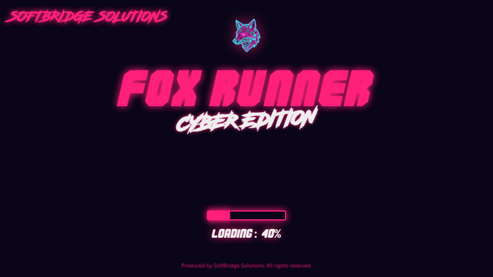

# Fox Runner

Fox Runner is a high-performance, web-based 3D arcade game featuring a retro-cyberpunk aesthetic. The core gameplay revolves around navigating a spaceship through a procedurally generated grid field filled with color-shifting obstacle cubes, requiring high reflexes and precise timing.

## Architecture and Technical Details

The codebase is built on a modern React, Three.js, and React Three Fiber (R3F) architecture. It uses declarative component rendering combined with low-level Three.js lifecycle hooks to optimize GPU draw calls and CPU thread utilization.

### 1. Rendering Pipeline and 3D Engine
* **React Three Fiber**: Serves as the React renderer for Three.js. It manages the Canvas lifecycle, camera creation, and resize handlers.
* **Lighting and Atmosphere**: A directional light simulates a star system, coupled with ambient lighting and linear distance fog to blend obstacles smoothly into the background horizon.
* **Bloom Post-Processing**: The game utilizes the UnrealBloomPass from Three.js post-processing to create glowing neon halos around emissive obstacles, ship exhaust streams, and wireframe grid lines.

### 2. State Management and Performance
* **Zustand**: A lightweight, hook-based state management library coordinates global state across React UI overlays and the 3D WebGL context, minimizing re-renders.
* **Component-Level Frame Loop**: Complex transformations, exhaust animation particles, and cube position checking are handled in custom useFrame loops to bypass React's virtual DOM reconciliation and execute directly in the WebGL animation frame.
* **Pre-multiplied Alpha Image Processing**: The custom application logo and icons use 32bpp ARGB channel extraction to render perfectly over the dynamic, colored canvas overlays without solid border rectangles or artifacts.

### 3. Dynamic Color System
* **CSS Variable Integration**: UI color styles are bound to CSS variables (--theme-color, --theme-glow) that update programmatically on every refresh.
* **Scene-UI Synchronization**: A curated color manager selects neon colors (pink, cyan, purple, lime green) randomly on load, syncing the 3D fog, obstacle lights, exhaust particle emitters, and CSS typography.
* **HSL Color Shifting**: Obstacle cubes and engine exhaust streams cycle colors smoothly over time using real-time HSL hue translation in the frame loop.

## Interface and Visuals

Below are screenshots demonstrating the UI panels, main menu, and active gameplay.

### Main Menu

### Regular Gameplay

### Tunnel Obstacles

